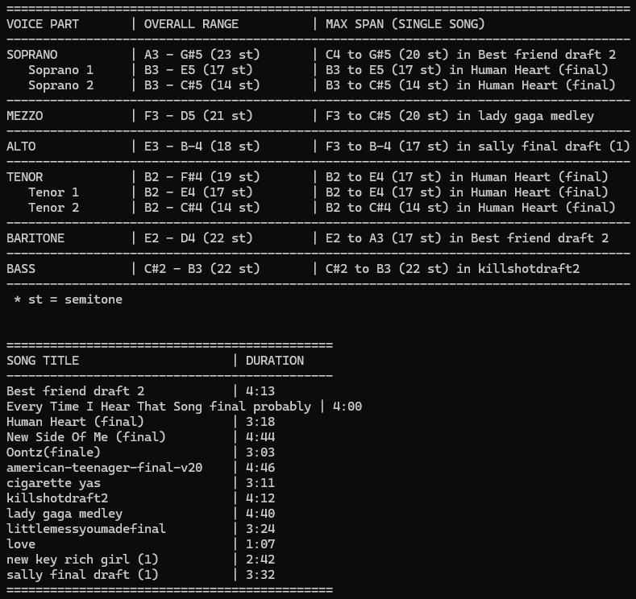

# 26Winter-MusescoreRangeFinder

This Python script converts MuseScore files (.mscz) to MusicXML and extracts pitch range and duration data.

## Features

- Converts local .mscz files to .musicxml using the MuseScore 4 executable.
- Sorts musical parts into Soprano, Mezzo, Alto, Tenor, Baritone, and Bass.
- Classifies divided parts, such as Soprano 1 and Soprano 2, based on part names.
- Calculates the absolute minimum and maximum pitch for each voice category across all parsed files.
- Identifies the single song containing the largest pitch span for each voice part.
- Calculates song duration in minutes and seconds.
- Measures duration by mapping exact tempo changes and absolute quarter note offsets.
- Generates fixed-width text tables detailing ranges, maximum spans, and song lengths.

## System setup

Install Python 3 on your machine.

Install the music21 library via pip.

Verify MuseScore 4 is installed.

## Configuration parameters

Open MusescoreAnalyzer.py in a text editor.

Locate the configuration section at the top of the file.

Update the SCORES_DIR variable with the directory path containing the MuseScore files.

Update the MUSE_PATH variable with the absolute file path to the MuseScore 4 executable.

## Usage instructions

Run MusescoreAnalyzer.py in your terminal.

The script checks the target directory for .mscz files missing a corresponding .musicxml file.

It launches MuseScore 4 in the background to process required conversions.

The script parses the converted files and prints the range analysis and duration tables to the console.

